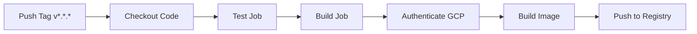

# Operations Runbook

This runbook documents deployment, maintenance, and troubleshooting procedures for the Iris Classification ML Service.

## Table of Contents

1. [Dependency Pinning Strategy](#dependency-pinning-strategy)
2. [Image Optimization](#image-optimization)
3. [Security Considerations](#security-considerations)
4. [CI/CD Workflow](#cicd-workflow)
5. [Versioning Strategy](#versioning-strategy)
6. [Troubleshooting](#troubleshooting)

---

## Dependency Pinning Strategy

### Approach

All dependencies use **exact version pinning** (using `==`) to ensure reproducibility across environments.

### Implementation
```txt
# app/requirements.txt
fastapi==0.128.0
scikit-learn==1.8.0
numpy==2.4.2
# ... all dependencies with exact versions
```

### Why This Matters

- **Reproducibility**: Same dependencies in dev, CI, and production
- **Stability**: Prevents unexpected breaking changes from updates
- **Security**: Explicit control over dependency versions
- **Auditability**: Clear record of exact software versions in use

### Updating Dependencies
```bash
# Update a specific package
pip install package==new.version
pip freeze > app/requirements.txt

# Test thoroughly
pytest tests/ -v

# Rebuild Docker image
docker build -t iris-service:test .
```

---

## Image Optimization

### Multi-Stage Build Strategy

The Dockerfile uses two stages to minimize final image size:

**Stage 1: Builder**
- Base: `python:3.11-slim`
- Purpose: Install dependencies with build tools
- Output: Compiled packages in `/root/.local`

**Stage 2: Runtime**
- Base: `python:3.11-slim`
- Purpose: Minimal runtime environment
- Copies only: Installed packages + application code

### Size Comparison

| Build Type | Image Size | Description |
|------------|-----------|-------------|
| Single-stage | ~850MB | Includes build tools, cache |
| Multi-stage (current) | **132MB** | Runtime only, optimized |

**Reduction**: ~84% smaller

### Optimization Techniques Applied

1. **Multi-stage builds**: Separate build and runtime stages
2. **Slim base image**: `python:3.11-slim` vs full Python image
3. **No cache**: `--no-cache-dir` flag on pip install
4. **`.dockerignore`**: Excludes unnecessary files from build context
5. **Minimal layers**: Combined RUN commands where possible

### Layer Caching Strategy

Commands ordered from least to most frequently changing:
```dockerfile
# 1. Base image (rarely changes)
FROM python:3.11-slim

# 2. Dependencies (changes occasionally)
COPY app/requirements.txt .
RUN pip install --user --no-cache-dir -r requirements.txt

# 3. Application code (changes frequently)
COPY app/ .
```

---

## Security Considerations

### Container Security

1. **Minimal Attack Surface**
   - Slim base image with minimal packages
   - No unnecessary build tools in runtime
   - Only required Python packages installed

2. **No Hardcoded Credentials**
   - All secrets stored in GitHub Secrets
   - Environment variables for configuration
   - `.gitignore` prevents accidental commits

3. **Dependency Scanning**
   - Manual review: Check `pip audit` before updates
   - Version pinning prevents supply chain attacks
   - Regular dependency updates for security patches

### Best Practices Applied

- ✅ Use official Python base images
- ✅ Pin all dependency versions
- ✅ Minimize image layers
- ✅ Use `.dockerignore` to exclude sensitive files
- ✅ Store secrets in GitHub Secrets, not code
- ✅ Run container as non-root user (TODO: implement)

### Recommended Security Enhancements
```dockerfile
# Add non-root user (future improvement)
RUN adduser --disabled-password --gecos '' appuser
USER appuser
```

---

## CI/CD Workflow

### Pipeline Overview


### Step-by-Step Workflow

**1. Trigger**
```bash
git tag v1.0.0
git push --tags
```

**2. Test Job**
- Checkout repository
- Set up Python 3.11
- Install dependencies
- Run `pytest tests/ -v`
- **Gate**: If tests fail, pipeline stops

**3. Build Job** (runs only if tests pass)
- Checkout repository
- Set up Docker Buildx
- Authenticate to GCP using service account
- Configure Docker for Artifact Registry
- Extract version from Git tag

**4. Build and Push**
```bash
# Build with two tags: version and latest
docker build -t IMAGE:v1.0.0 -t IMAGE:latest .

# Push both tags
docker push IMAGE:v1.0.0
docker push IMAGE:latest
```

### Required GitHub Secrets

| Secret | Purpose | How to Obtain |
|--------|---------|---------------|
| `GCP_PROJECT_ID` | GCP project identifier | GCP Console → Project Info |
| `GCP_SA_KEY` | Service account credentials | GCP Console → IAM → Service Accounts |

### Manual Workflow Trigger
```bash
# From GitHub UI: Actions → Build and Push → Run workflow
# Or force push a tag:
git tag -f v1.0.0
git push --tags --force
```

---

## Versioning Strategy

### Semantic Versioning (SemVer)

Format: `vMAJOR.MINOR.PATCH`

- **MAJOR**: Breaking API changes
- **MINOR**: New features, backward compatible
- **PATCH**: Bug fixes, backward compatible

### Examples
```bash
v1.0.0  # Initial release
v1.0.1  # Bug fix in prediction endpoint
v1.1.0  # Add new /batch-predict endpoint
v2.0.0  # Breaking: Change response format
```

### Tagging Workflow
```bash
# Create and push tag
git tag v1.0.1 -m "Fix model loading path"
git push origin v1.0.1

# CI/CD automatically builds and pushes:
# - IMAGE:v1.0.1
# - IMAGE:latest
```

### Image Tag Strategy

- **Version tag** (`v1.0.0`): Immutable, specific version
- **Latest tag** (`latest`): Always points to most recent version

---

## Troubleshooting

### Issue: Docker Build Fails

**Symptoms**:
```
ERROR: failed to solve: process "/bin/sh -c pip install..." did not complete successfully
```

**Solutions**:
1. Check `requirements.txt` for version conflicts
2. Verify Python version compatibility
3. Try building with `--no-cache` flag:
```bash
   docker build --no-cache -t iris-service:test .
```

---

### Issue: Tests Pass Locally but Fail in CI

**Symptoms**:
```
ModuleNotFoundError: No module named 'app'
```

**Solutions**:
1. Verify paths in `test_app.py` are relative
2. Check working directory in workflow YAML:
```yaml
   - name: Run tests
     working-directory: module3/milestone2
     run: pytest tests/ -v
```
3. Ensure `__init__.py` exists in `app/` and `tests/`

---

### Issue: Image Push to Registry Fails

**Symptoms**:
```
Error: authentication required
```

**Solutions**:
1. Verify `GCP_SA_KEY` secret is set correctly
2. Check service account has Artifact Registry Writer role
3. Confirm registry URL format:
```
   us-central1-docker.pkg.dev/PROJECT_ID/REPOSITORY/IMAGE
```
4. Re-authenticate:
```bash
   gcloud auth configure-docker us-central1-docker.pkg.dev
```

---

### Issue: Container Runs but API Not Accessible

**Symptoms**:
```
curl: (7) Failed to connect to localhost port 8080
```

**Solutions**:
1. Check container is running:
```bash
   docker ps
```
2. Verify port mapping:
```bash
   docker run -p 8080:8080 IMAGE
```
3. Check container logs:
```bash
   docker logs CONTAINER_ID
```
4. Test from inside container:
```bash
   docker exec -it CONTAINER_ID curl localhost:8080/health
```

---

### Issue: Model Loading Fails

**Symptoms**:
```
FileNotFoundError: [Errno 2] No such file or directory: 'model.pkl'
```

**Solutions**:
1. Verify `model.pkl` exists in `app/` directory
2. Check Dockerfile copies app correctly:
```dockerfile
   COPY app/ .
```
3. Use absolute path in code:
```python
   from pathlib import Path
   MODEL_PATH = Path(__file__).parent / "model.pkl"
   model = joblib.load(MODEL_PATH)
```

---

## Quick Reference Commands
```bash
# Build locally
docker build -t iris-service:test .

# Run locally
docker run -d -p 8080:8080 --name iris-api iris-service:test

# View logs
docker logs iris-api

# Stop and remove
docker stop iris-api && docker rm iris-api

# Run tests
pytest tests/ -v

# Create release
git tag v1.0.0 && git push --tags

# Check image size
docker images iris-service:test
```

---

## Maintenance Schedule

| Task | Frequency | Command |
|------|-----------|---------|
| Dependency updates | Monthly | `pip list --outdated` |
| Security audit | Weekly | `pip audit` |
| Image cleanup | Weekly | `docker system prune -a` |
| Test coverage check | Per commit | `pytest --cov` |

---

## Contact & Support

- **Course**: IDS 568 - MLOps
- **Repository**: https://github.com/josephine-chou/ids568-mlops-m1
- **Issues**: Create GitHub issue for bugs or questions